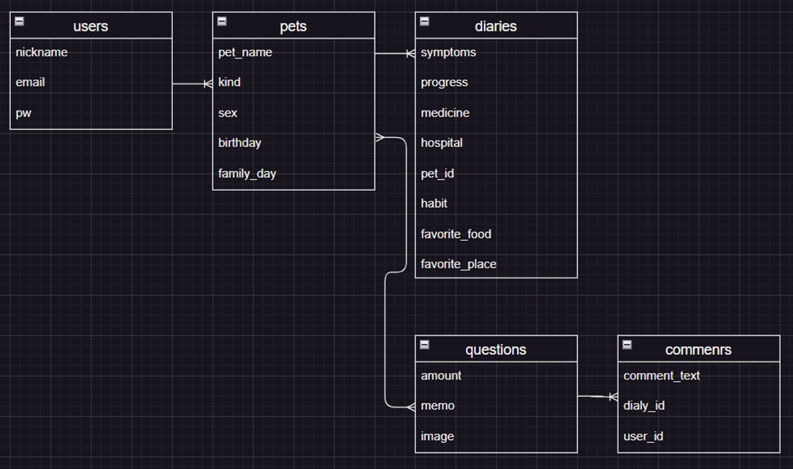
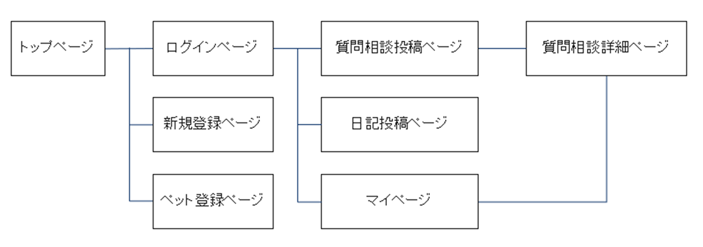

## アプリケーション名 
カメ日記
## アプリケーション概要
カメを飼っているユーザーの困り事の情報共有の場
## URL（GitHub）
https://github.com/ohashiyukio/original
## テスト用アカウント
ユーザー名：admin
PW:1234
## 利用方法
ログイン後、日記投稿と質問相談投稿。質問相談投稿にはコメント投稿機能。

## アプリ作成背景
開発者自身がカメを飼っていた際、けがや病気で応急処置や対処法を知りたかったが
適切な情報が入手できない経験がありました。本アプリを使ってカメを飼っている仲間とつながり
カメを飼育する上での豆知識や困りごとなどを気軽に聞ける相談相手がいる
情報共有、コミュニティの場になればよいと思い、今回作ってみました。

## 参考動画（質問相談症状のワード検索、投稿一覧、マイページです）
https://gyazo.com/80527ec22e112cb2db0c8ec6fcfbd26a

## 今後の実装予定
地図上で現在位置から近い動物病院やペットショップのピン表示

## DB設計

## 画面遷移図

## 開発環境
1. フロントエンド
HTML CSS
2. バックエンド
Ruby on Rails(v7.0.0)
3. テキストエディタ
VSCord
4. API
GoogleMaps API

## 製作時間
1週間

## 工夫したポイント
今自分がいる場所からGoogleMaps APIを使って動物専門病院、ペットショップなどを検索して
（爬虫類専門の病院は少ないと思いますので）普段から場所を把握しておけば
いざとなったとき直ぐに向かう事が出来ると思い地図を実装しました。
（検索ボックス実装中です）

